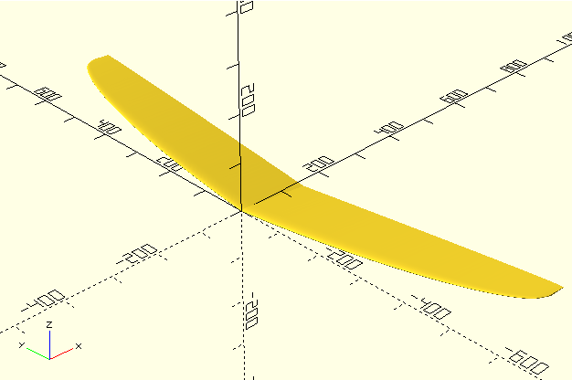

# WingSCAD

WingSCAD is focused on generating 3D wing meshes (STL) from 2D airfoil profiles using OpenSCAD. The central script is `wing_generator.scad`, which contains the geometry and export logic to build wing volumes from a profile. The `txt_to_scad.py` helper is provided only to make it easy to convert plain-text XY point lists into OpenSCAD variable files for inclusion.



Contents
- `wing_generator.scad` - the primary OpenSCAD script: build wings and export STLs
- `ag04.scad`, `ag08.scad` - example profile variable files (can be generated or provided)
- `txt_to_scad/` - helper script and sample text files
  - `txt_to_scad.py` - small converter: plain-text XY → OpenSCAD array variable
  - `ag04.txt`, `ag08.txt` - sample point lists

Prerequisites
- Python 3 (to run the optional converter script)
- OpenSCAD (to open, preview, and export the final STL)

Workflow (recommended)
1. Prepare your 2D wing profile as an OpenSCAD variable file. You can:
   - Use `txt_to_scad.py` to convert a text file of `x y` pairs into a `.scad` variable file, or
   - Manually create a `.scad` file that defines the profile variable the `wing_generator.scad` expects.

   Example (convert a text file):

```bash
python3 txt_to_scad/txt_to_scad.py txt_to_scad/ag04.txt AG04_POINTS ag04.scad
```

2. Open `wing_generator.scad` in OpenSCAD and include your profile file near the top of the script:

```scad
include <ag04.scad>;
// wing_generator.scad expects a variable like AG04_POINTS (check the file for the exact name)
```

3. Edit the parameters inside `wing_generator.scad` as needed (span, chord scaling, twist, resolution, etc.).

4. Preview the model in OpenSCAD and export the mesh as an STL (`Design → Export as STL`) or use OpenSCAD's command-line export options if you prefer automation.

Notes & tips
- `wing_generator.scad` is the meat of the repository — start there to understand or change how wings are shaped and exported.
- `txt_to_scad.py` is optional: it simply converts `x y` lists into a variable. The converter skips blank lines, comments (`#`), and `...` lines.
- Keep profile point order consistent (leading edge → trailing edge or whatever the generator expects) — check `wing_generator.scad` for the required ordering.

Contact / Contribution
- Suggestions and PRs are welcome (examples: support for different profile formats, automated export scripts, parameter presets).

License
- This project is distributed under the Creative Commons Attribution-NonCommercial 4.0 International License (CC BY-NC 4.0). See `LICENSE` for full terms and attribution requirements.
